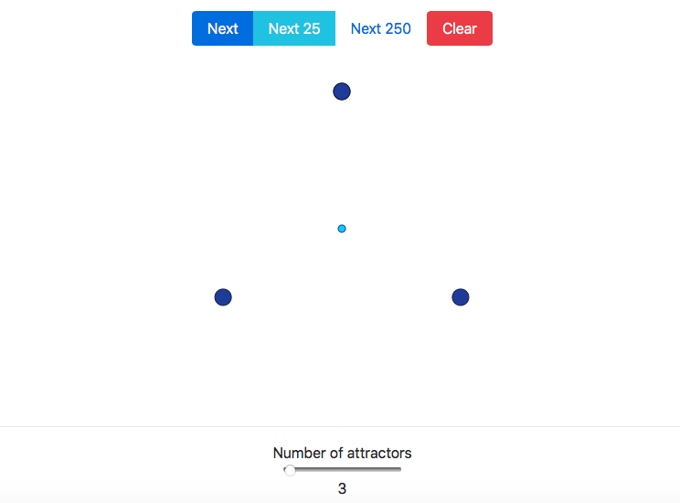

# Chaos game
The algorithm goes like this:
  1. Pick a target point (large circle) at random
  2. Go halfway between the current position and the target position
  3. Mark the new point (small circle)
  4. Repeat from `1`

Do you see a pattern emerge?

Inspired by [Numberphile](https://www.youtube.com/watch?v=kbKtFN71Lfs).

## Preview
[]()

## Compile

Compile to javascript with `elm-make`
```
elm-make src/elm/Main.elm --output src/static/js/main.js
```
